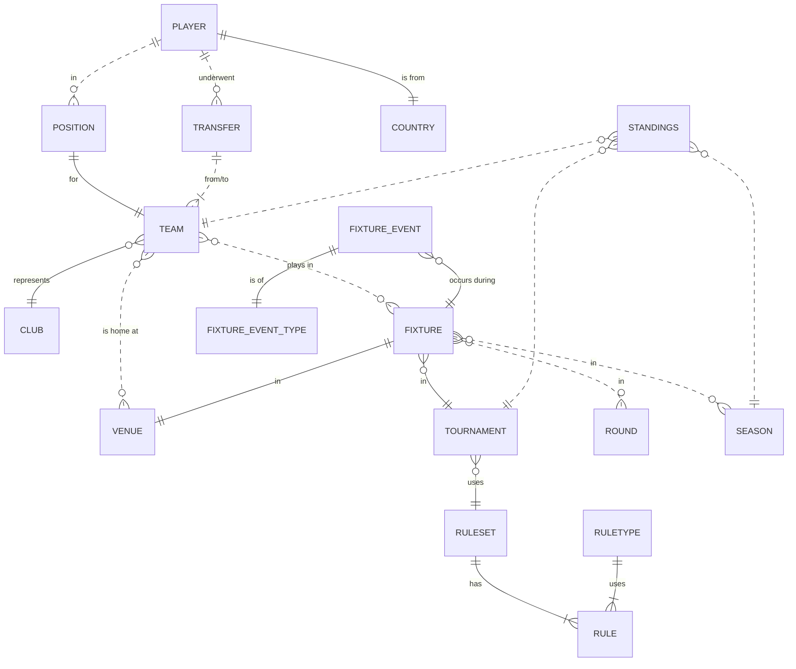
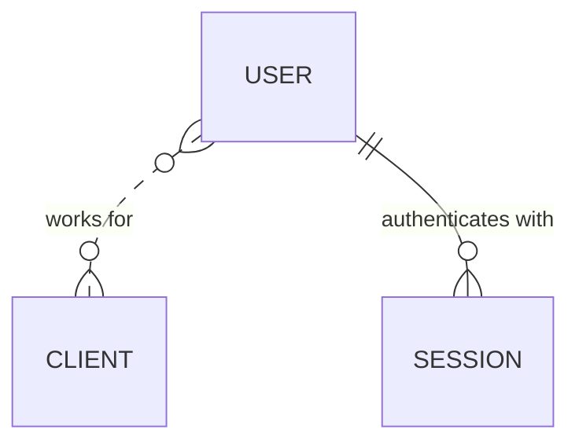
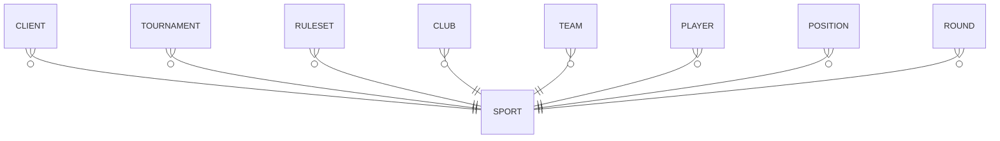
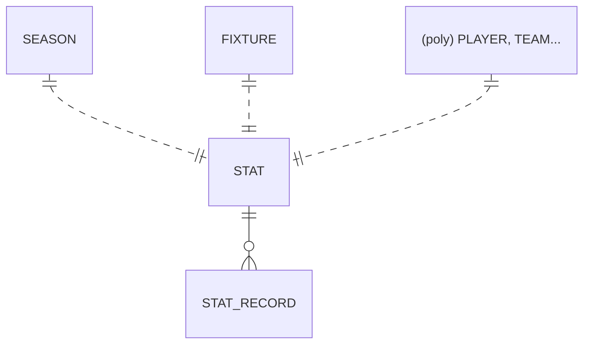

# Database Overview

This [entity relationship diagram](https://mermaid.js.org/syntax/entityRelationshipDiagram.html) offers a high-level overview of key entities in the database. **This is meant to express design intention and is not a comprehensive breakdown. For full implementation detail, refer to the schema.**

- While ROUNDS -> SEASONS -> TOURNAMENTS seems like a natural relational structure, in practice they are decoupled to avoid repetition and simplify querying

## Users and Clients

- Standard Laravel authentication/permission entities are not visualised here
- USER is normally be related to a CLIENT, but there is also a superuser role which permits client-independent access. This is restricted to Framework staff
- If not superuser, assignment to a CLIENT grants USER access to all entities managed by CLIENT including tournaments, fixtures, players etc. according to the user's role
- Relationships between CLIENT and other entities are not visualised here for reasons of simplicity. If in doubt, check the table for a `client_id` field

## Sports

- SPORT is a superuser-only entity managed by Framework
- All major entities are restricted to a single sport, including CLIENT. In the unlikely event that a given document ' crosses' sports, two separate documents must be created. For example, if player X plays both netball and basketball, then there will need to be one instance of player X for netball (within all the applicable data structures) and another one for basketball

## Statistics

- The STAT table is [polymorphic](https://laravel.com/docs/12.x/eloquent-relationships#polymorphic-relationships) so records can be associated with a specific PLAYER or TEAM, and potentially other entities in future
- FIXTURE and SEASON relationships to STAT are non-polymorphic and optional (nullable)
